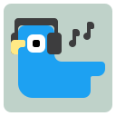

tweetmuff

# Muted posts simply never show up

- **No traces** Posts with your muted words are removed before X draws them.
- **Your X mute list** Picked up from X’s settings, including “exclude people you follow.”
- **Out of sight** Counts only. The words stay hidden.
- **One switch** Turn filtering on or off anytime.

<i></i><i></i><i></i>x.com/home

---

tweetmuff

# Your words live on their own page

- **All in one place** Every word picked up from X. Dashed ones skip accounts you follow.
- **Add your own** Extra words, with /regex/ support.
- **Stays on your device** Nothing is sent anywhere. No tracking.

<i></i><i></i><i></i><b>tweetmuff</b>chrome-extension://…/pages/options.html

